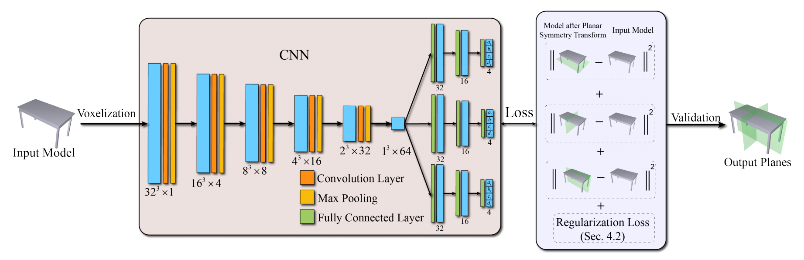
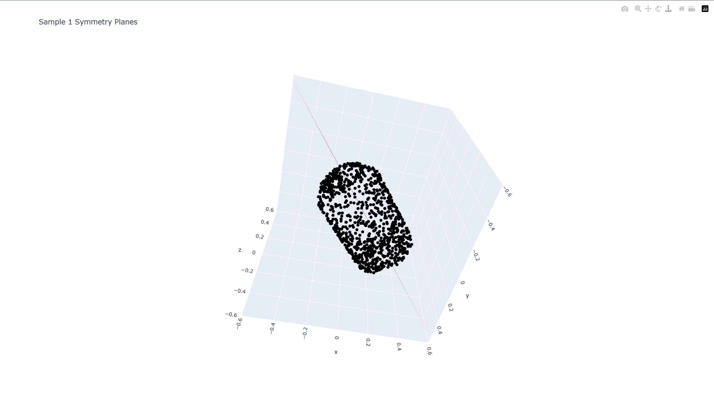
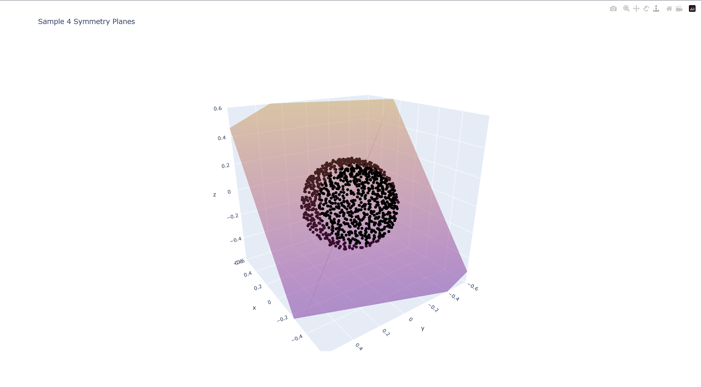
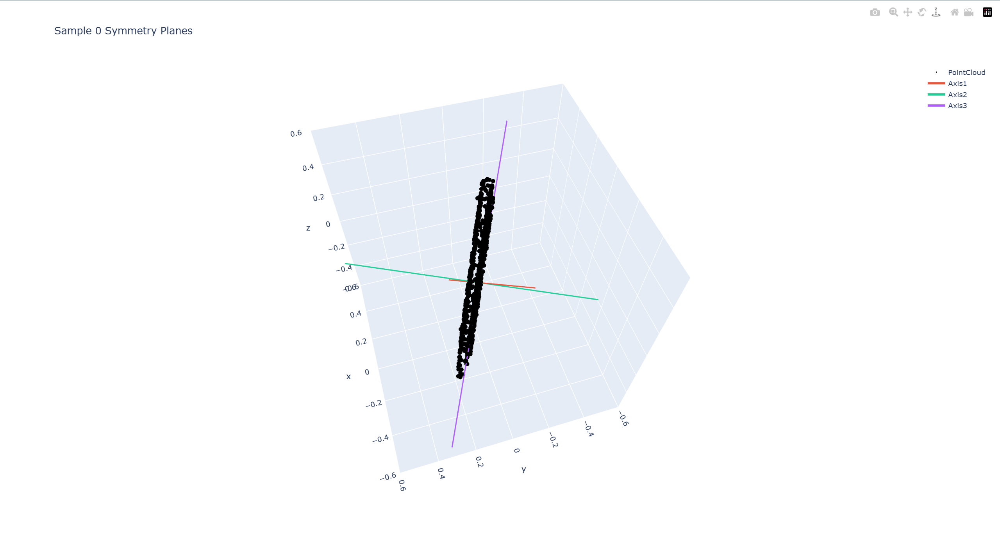

# PRS-Net: Planar Reflective Symmetry Detection Net for 3D Models
## 简介
PRS-Net是一个基于3D CNN实现的，用于自动发现三维物体的全局平面反射对称性的模型。
该模型的主要贡献有：
- 提出首个用于检测三维物体全局平面反射对称性的无监督深度学习方法；且与最先进的方法相比，该方法速度提高数百倍，准确性与可靠性较为优。
- 设计了对称性距离损失函数并结合正则化损失来避免生成重复对称平面，使得整个网络可以用无监督学习的方式进行训练，也让数据收集变得更加容易。


本项目为对PRS-Net论文的复现项目。

[原文地址](https://arxiv.org/abs/2303.06330)

## 数据集
PRS-Net使用[Shapenetcore.v2](https://huggingface.co/datasets/ShapeNet/ShapeNetCore)作为数据集。下载数据集后需将数据集放在preprocess/shapenet目录下。

## 依赖项
本项目的依赖项主要有：
- open3d==0.15.1
- numpy==1.24.4
- torch==2.4.1+cu121
- tqdm==4.67.1
- plotly==5.24.1

## 训练
1. 下载数据集并放在preprocess/shapenet目录下。
2. 进入preprocess目录，运行
```shell
python data_preprocess.py
```
进行数据预处理。经过预处理的数据会存放在datasets/shapeneta目录中，并以8 : 2的比例随机分为训练集和测试集。预处理会对每个模型进行随机旋转并保存三个进随机旋转增强后的模型副本，可通过 __--num_variants__ 参数来决定一个模型保存的副本的数目。
3. 在根目录下运行
```shell
python train.py
```
进行训练，默认epoch为300，可通过 __--epoch__ 参数调整训练的epoch。训练过程中会将之前训练的状态进行保存，以便在某次训练中断后可继续恢复训练，可通过 __--resume__ 参数恢复上一次中断的训练。当一次完整的训练结束后会自动清除保存的记录点，以免影响下一次训练。完成训练的模型将保存在trained_model目录中，将分别保存验证过程中损失最小的模型 __best_model__ 与最后一个epoch训练的模型 __last_model__。 
4. 在根目录下运行
```shell
python test.py
```
进行测试，并将结果可视化，可视化结果将通过外部浏览器展示。默认的显示结果为体素化的模型与预测的一个对称面。可通过参数 __--num_planes__ 与参数 __--num_quads__ 分别设定显示的平面与旋转轴数目，范围为[0,3]。默认测试集为datasets/shapenet/test目录下的测试集，可通过参数 __--data_dir__ 指定测试集目录。

## 复现结果演示
### result1
<div style="text-align: center;">

</div>

### result2
<div style="text-align: center;">

</div>

### result3
<div style="text-align: center;">

</div>
